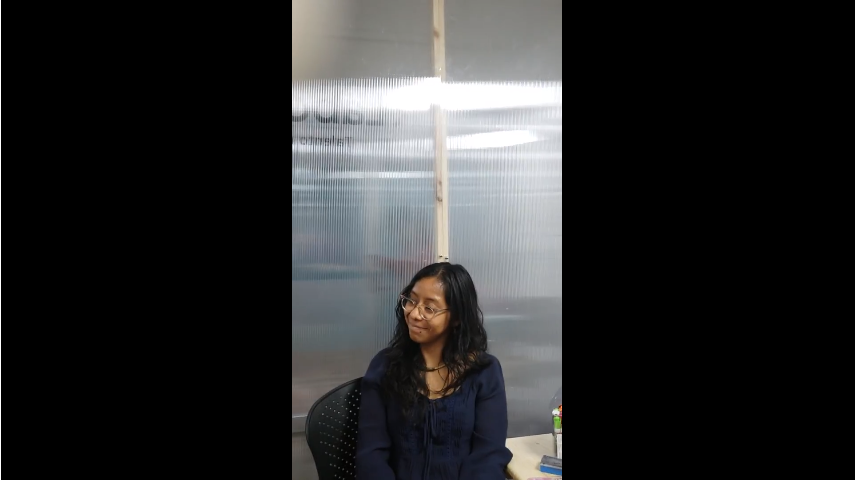
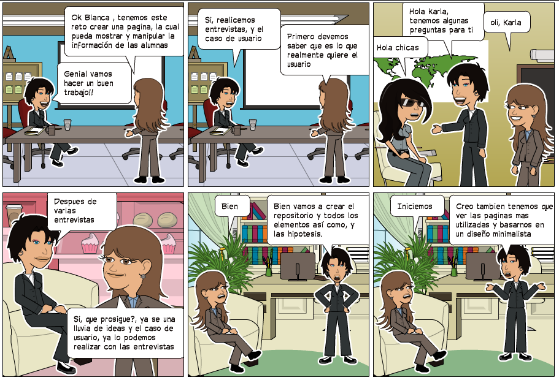
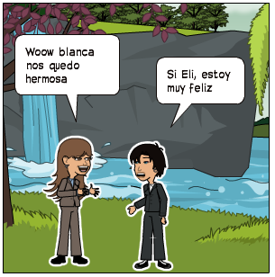
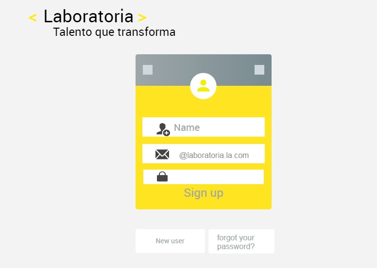
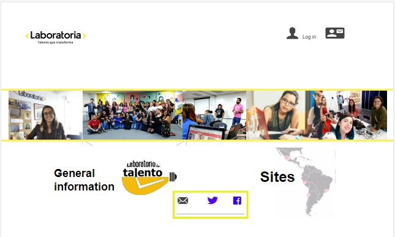
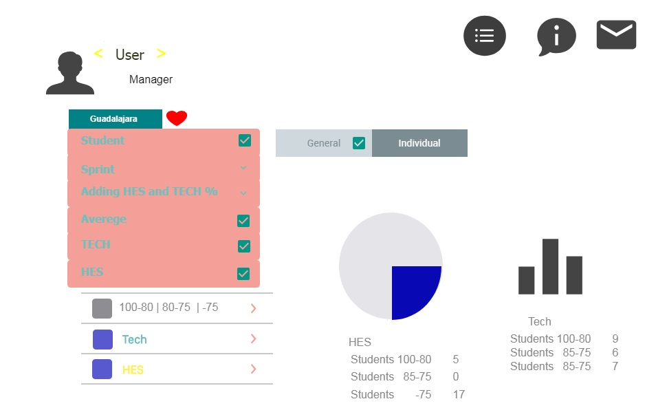
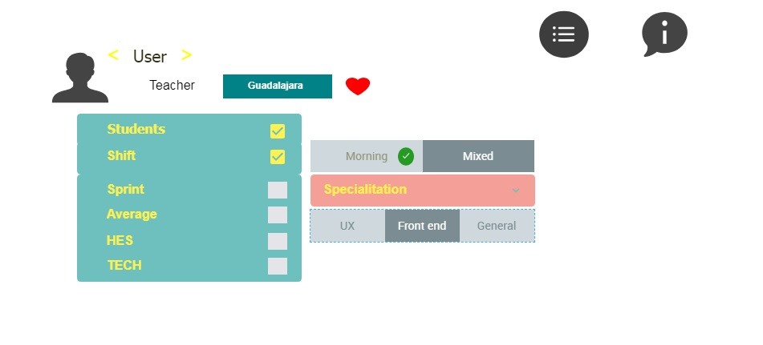
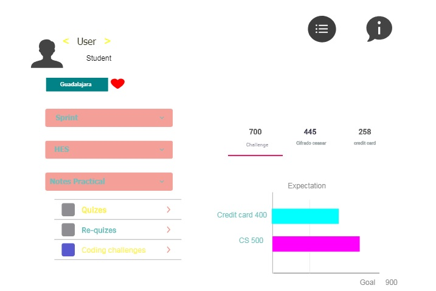

## CREA UN SKETCH PARA LA HERRAMIENTA DEL DASHBOARD DE LABORATORIA
>El dashboard es una herramienta utilizada por profesores, training managers, directores y gerentes de Laboratoria para ver rápidamente qué está pasando en el salón de clases de Laboratoria. En el dashboard, los usuarios mencionados pueden ver rápidamente estadísticas y datos en tiempo real como:
 
* Número de alumnas inscritas
* Número de alumnas que desertaron
* Número de alumnas y % de alumnas que pasan el criterio mínimo de evaluación
* Promedio de notas por sprint
* Promedio de notas HSE
* Promedio de notas técnicas

>Además, dado que Laboratoria tiene muchas generaciones, regularmente 2 generaciones por año (estas generaciones empezaron en el 2014), y que opera en 4 sedes (Arequipa, Ciudad de México, Lima y Santiago de Chile), es posible que los usuarios quieran ver datos de sedes / generaciones anteriores para poder hacer comparaciones.

---

## Idea inicial
>Crear un medio para revisar la información. 

---

## Problemática:
>¿Que está buscando realmente nuestro usuario?

>Manejo correcto de la data de manera eficaz y eficiente siguiendo las especificaciones de nuestros clientes con diferentes herramientas como entrevistas, lluvia de ideas, se buscarán las diferentes opiniones de los usuarios, para envase de un análisis completo  de sus necesidades, establecer los parámetros para resolver  dicho problema.

>Al presentarse la problemática de crear este dashboard, lo primero fue recurrir a una lluvia de ideas para canalizar ideas y llegar a la creación de un prototipo

>Lluvia de ideas:
- Fácil de visualizar
- Colores armónicos
- Paleta de colores
- Fácil de usar
- Fácil de encontrar la información
- Fácil de mostrar la información
- Fácil de entender la información

## Hipótesis de la lluvia de ideas
>En un análisis de la información nuestros clientes quieren un diseño minimalista con una paleta de colores armoniosa, fácil de manejar y acceder capaz de ser utilizado por todo tipo de usuarios, pero dirigido a  el project manager.  

* Se realizaron entrevistas para conocer el caso del usuario

---
## Entrevistas

 
## Hipótesis de las entrevistas
>A partir de las entrevistas nos dimos cuentas que nuestro usuario final necesita poder exportar información, manipularla, poder manipularla, poder comparar la información para tener resultados más eficientes, de la misma manera conectar nuestra página a el correo para poder mandar mail de la información obtenida.
 
---
## Historia de usuario

>Tipo de usuario: Está dirigida al Master, Project Manager y Teacher quiere poder ver, manipular, comparar la información por cede, por alumna, por sprint, por nivel Tech, nivel Hse, para poder determinar en qué se puede ayudar a la alumna a mejorar y guiarla en el proceso de aprendizaje, así como identificar si algo se está haciendo mal por parte de el equipo de trabajo o bien que se debe continuar haciendo, para beneficiar todo el proceso de ambos lados, y las alumnas solo pueden observar sus calificaciones y notas de los Teacher.
>Otro punto importante es la seguridad de la información por eso se crearán perfiles que tendrán diferentes acciones a realizar, personalizado dependiendo del nivel de jerarquía. 

## Criterios de aceptación del usuario:

- Ver la data
- Manipular la data
- Comparar la data
- Ir desde lo más amplio a lo mas especifico: Cede, Alumna, Sprint, Nivel Tech, Nivel Hse.
- Interfaz amigable
- De información fiable
- Perfiles personalizados.

---
## Flujo de la aplicación

---
## Sketching   

---
## Prototyping

- Login

- Inicio

- Cedes

- Perfil Master

- Perfil Proyect Manager

- Perfil Teacher poca funcionalidad

- Perfil Teacher con toda la funcionalidad

- Perfil Alumna

---
## Creado por

> Maria Elizabeth Vera Meza    
* GDL181026           

> Blanca Luisa Valencia Hernandez  
* GDL181008    

